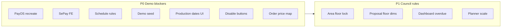

# Council feedback triage (FE vs BE)

Tài liệu **một chỗ** cho feedback hội đồng/demo: quy ước đánh giá, rule đã chốt, ma trận ưu tiên, spec BE (hiện trạng → target), việc FE, seed/demo checklist, và thứ tự triển khai.

Đây là **docs-only** (spec để build). Chưa kèm thay đổi code. Khi implement, cập nhật thêm `docs/api-reference.md`, `docs/payment-service-guide.md` cho khớp contract thật.

**Nguồn đối chiếu code/docs hiện tại**

- `docs/backend-api-dev-guide.md`
- `docs/payment-service-guide.md`
- `docs/api-reference.md` (§Orders, Payments, Project areas, Schedules, Dashboard, Production)
- `docs/mongodb-room-planner-guide.md` (planner / scene — chủ yếu FE)

---

## 1. Quy ước đánh giá

| Thuật ngữ | Ý nghĩa |
| --- | --- |
| **Target** | Kết quả demo/hội đồng cần thấy trên UI hoặc API |
| **Độ khó** | **S** ≤1–2 ngày · **M** 3–5 ngày · **L** >1 tuần hoặc đụng schema + FE + planner |
| **Ưu tiên** | **P0** demo-blocker → **P1** rule hội đồng → **P2** polish → **P3** backlog |
| **Quy mô** | **Minor** = validate / DTO / map · **Major** = schema / rule mới / flow mới |
| **Hiện trạng** | Hành vi baseline hiện có trên BE |
| **Target** | Rule/contract đã chốt để implement |

---

## 2. Quyết định rule mặc định (đã chốt build theo hướng này)

1. **Lịch**  
   Giữ `ScheduledEnd` trên BE nhưng **bắt buộc** khi tạo (slot = start → end). Validate giờ hành chính **08:00–17:00 (Asia/Ho_Chi_Minh / SE Asia Standard Time)**. **Không overlap** cùng `AssignedStaffId` (bỏ `CANCELLED`). **Tối đa 1 lịch ACTIVE / ngày / người** (theo ngày VN của `ScheduledStart`). Calendar FE render khoảng start–end.

2. **Area hình học**  
   **Không** thêm shape engine (tam giác / lục giác…). Giữ W / L / H / sqm cho ROOM chữ nhật. Thêm `isIrregularLayout` (bool) để **bỏ qua** check `W×L ≈ sqm`. FLOOR gắn blueprint Room Planner; proposal/scene bắt buộc map FLOOR + hiện thông tin floor.

3. **Deadline phase**  
   **Không** thêm bảng deadline riêng trước demo. Derive overdue từ field có sẵn (`TargetCompletionDate`, production `EstimatedCompletionDate`, schedule end nếu cần) + mở rộng dashboard `dueBucket` / `flow` / `isOverdue`. Schema phase-deadline = **P3** sau demo.

4. **PayOS / SePay**  
   BE recreate-on-demand (`forceNew`) — **không** poll PayOS status mỗi lần GET. SePay là **provider song song đã có** trên BE; FE gắn UI chọn/hiển thị cạnh PayOS.

**Đã loại (không làm theo hướng này)**

- Bỏ hẳn end time trên lịch (mất “rào khoảng”).
- Chỉ FE filter overlap (không đủ an toàn).
- Shape catalog / GLB bounding-box validate trước demo.
- Rewrite `project.status` → enum 3 flow trước demo (phá workflow tracker).

---

## 3. Ma trận tổng hợp

| # | Task | Layer | P | Khó | Quy mô | Spec |
| --- | --- | --- | --- | --- | --- | --- |
| 1 | PayOS link valid + recreate + message | **BE** (+ FE toast) | P0 | M | Major | §4.1 |
| 2 | Gắn SePay trên FE payment | **FE** (BE đã có) | P0 | S | Minor | §4.2 |
| 3 | Assign designer max project | **Verify** (BE đã lock=2) | P0 | S | Minor | §4.3 |
| 4 | Lịch overlap + 1/ngày + giờ HV | **BE** (+ FE calendar) | P0 | M | Major | §4.4 |
| 5 | Calendar hiện end / slot rõ | **FE** (+ BE bắt buộc end) | P0 | S | Minor | §4.4 |
| 6 | Floor/area count vs `NumberOfFloors` | **BE** | P1 | M | Major | §4.5 |
| 7 | Area dimension + irregular flag | **BE** (+ FE form) | P1 | M | Major | §4.5 |
| 8 | Proposal hiện floor + dims area | **BE DTO** + **FE** | P1 | S | Minor | §4.6 |
| 9 | Scene 2D + scale Room Planner | **FE/planner** (+ BE snapshot) | P1 | L | Major | §4.7 |
| 10 | Order original price field sai | **FE** (map đúng API) | P0 | S | Minor | §4.8 |
| 11 | Dashboard overdue theo phase / 3 flow | **BE** derive + **FE** badge | P1 | M | Major | §4.9 |
| 12 | Dashboard admin charts review | **FE** chủ yếu | P2 | M | Minor–Major | §4.10 |
| 13 | Seed data chuẩn cho demo | **BE seed** + checklist | P0 | M | Major | §5 |
| 14 | Dashboard sale data phụ trách | **FE** `scope=mine` + seed | P0 | S | Minor | §5 |
| 15 | Customize flow demo | **Both** (cắt scope) | P2 | L | Major | §4.11 |
| 16 | Complete schedule trước ngày hẹn | **BE** | P1 | S | Minor | §4.4 |
| 17 | Layout cầu thang / 2 tầng | **FE planner** | P2 | L | Major | §4.12 |
| 18 | Floor auto + chiều cao lỗi layout | **FE planner** | P2 | M | Major | §4.12 |
| 19 | Production startDate UI | **FE** (+ BE list DTO) | P0 | S | Minor | §4.13 |
| 20 | Product size đúng trên planner | **FE** set W/H/D từ version | P1 | M | Major | §4.7 |
| 21 | Confirm deli / complete vẫn bấm | **FE** disable (BE idempotent) | P0 | S | Minor | §4.14 |



---

## 4. Chi tiết theo task

Mỗi mục: **Target demo** · **Hiện trạng** · **Contract / rule** · **Acceptance** · **Layer**.

### 4.1 PayOS — validate / recreate link + message

| | |
| --- | --- |
| **P / khó / quy mô** | P0 · M · Major |
| **Layer** | BE (logic chung) + FE toast / retry |
| **Target demo** | Mở checkout không chết im; link hết hạn/lỗi → tạo link mới + mã lỗi rõ |

**Hiện trạng**

- `POST /api/payments/{paymentId}/transactions` reuse DB `PENDING` + `PaymentUrl`.
- Fail create → `PAYOS_CREATE_LINK_FAILED`, rollback; **không** auto-recreate.
- Client PayOS chỉ Create / VerifyWebhook — **không** poll status trước khi FE dùng URL.

**Target contract**

Request (bổ sung):

```json
{
  "paymentProvider": "PAYOS",
  "paymentMethod": "PAYOS_CHECKOUT",
  "forceNew": false
}
```

- `forceNew` default `false`: giữ hành vi reuse PENDING nếu còn URL.
- `forceNew: true`: **cancel** PENDING PayOS cũ (nếu có) → **create** link mới.
- Response thêm `recreated: true|false`.
- Message khi recreate OK: `PayOS payment link recreated successfully.`
- Fail create: vẫn `PAYOS_CREATE_LINK_FAILED`, message hướng dẫn retry với `forceNew=true`.
- **Không** gọi PayOS get-status mỗi lần GET active.

**Acceptance**

- [ ] FE mở URL fail → gọi lại cùng endpoint với `forceNew: true` → nhận URL mới + `recreated: true`.
- [ ] Toast hiện `message` / `errorCode` khi fail.
- [ ] Cập nhật `docs/payment-service-guide.md` + api-reference §Payments khi code xong.

---

### 4.2 SePay trên màn thanh toán

| | |
| --- | --- |
| **P / khó / quy mô** | P0 · S · Minor |
| **Layer** | **FE only** (BE đã có) |
| **Target demo** | Customer chọn / thấy SePay cạnh PayOS |

**Hiện trạng BE:** `/transactions` với `SEPAY` + `QR_CODE`, webhook, VietQR — đủ path.

**FE**

- UI chọn provider: PayOS | SePay.
- SePay: `paymentProvider: "SEPAY"`, `paymentMethod: "QR_CODE"`; hiện QR từ `qrContent` / URL trả về.

**Acceptance**

- [ ] Hai provider hiện song song trên màn thanh toán start fee / order payment.
- [ ] Flow SePay thanh toán thành công qua webhook như tài liệu payment hiện có.

---

### 4.3 Assign designer — max project

| | |
| --- | --- |
| **P / khó / quy mô** | P0 · S · Minor |
| **Layer** | Verify BE + FE UX |
| **Target demo** | Không assign khi designer FULL |

**Hiện trạng BE**

- Hard lock `MaxActiveDesignerProjects = 2` trên assign → **409**.
- `GET .../designers/available` vẫn list FULL (soft picker).

**Target**

- Giữ cap = 2 trừ khi hội đồng đổi số.
- FE: disable assign khi FULL; hiện message 409 (vd. `Designer has reached maximum active project capacity.`).

**Acceptance**

- [ ] Reproduce: designer đã 2 project active → assign bị 409, FE không “im lặng thành công”.
- [ ] Nếu vẫn assign được → regression BE; nếu BE đúng mà UI vẫn bấm được → FE.

---

### 4.4 Lịch — end bắt buộc, giờ hành chính, overlap, 1/ngày, complete-before-date

| | |
| --- | --- |
| **P / khó / quy mô** | P0 (rules) + P1 (complete-before-date) · M / S · Major / Minor |
| **Layer** | BE rules + FE calendar |
| **Target demo** | Không double-book; calendar thấy khoảng; appointment trong giờ HV; 1 lịch/ngày/người; không complete trước ngày start |

**Hiện trạng BE** (`ProjectScheduleService`)

- `ScheduledStart` phải future.
- `ScheduledEnd` **optional**; nếu có thì `> start`.
- **Chưa** overlap staff, **chưa** business hours, **chưa** 1/ngày.
- Chỉ unique active DELIVERY / project.

**Target rules (create + update khi slot/staff đổi)**

| Rule | Chi tiết | Error code đề xuất |
| --- | --- | --- |
| End required | `scheduledEnd` bắt buộc | `SCHEDULE_END_REQUIRED` |
| Same VN day | start & end cùng ngày lịch VN | `SCHEDULE_OUTSIDE_BUSINESS_HOURS` (hoặc validation riêng nếu tách) |
| Business hours | cả start & end trong **08:00–17:00** VN | `SCHEDULE_OUTSIDE_BUSINESS_HOURS` |
| Overlap | cùng `AssignedStaffId`, status ≠ `CANCELLED`, khoảng thời gian giao nhau | `STAFF_SCHEDULE_OVERLAP` |
| 1 / day / staff | tối đa 1 lịch non-cancelled / staff / ngày VN (theo ngày của start) | `STAFF_SCHEDULE_DAILY_LIMIT` |
| Complete guard | không `COMPLETE` nếu ngày VN hôm nay `<` ngày VN của `ScheduledStart` | `SCHEDULE_COMPLETE_BEFORE_START_DATE` |

**Update:** chỉ re-validate slot/staff khi `scheduledStart`, `scheduledEnd`, hoặc `assignedStaffId` thực sự đổi (đổi title không được fail vì slot quá khứ).

**Timezone:** ưu tiên `Asia/Ho_Chi_Minh`; trên Windows có thể map `SE Asia Standard Time`.

**FE**

- Calendar event = `[scheduledStart, scheduledEnd]`.
- Hiện rõ message theo `errorCode` ở trên.

**Acceptance**

- [ ] Tạo lịch thiếu end → 400 + `SCHEDULE_END_REQUIRED`.
- [ ] Hai lịch cùng staff overlap giờ → `STAFF_SCHEDULE_OVERLAP`.
- [ ] Hai lịch cùng staff cùng ngày (dù khác giờ trong cửa sổ) → `STAFF_SCHEDULE_DAILY_LIMIT` (theo rule 1/ngày đã chốt).
- [ ] Ngoài 08–17 VN → `SCHEDULE_OUTSIDE_BUSINESS_HOURS`.
- [ ] Complete trước ngày start → `SCHEDULE_COMPLETE_BEFORE_START_DATE`.
- [ ] Calendar FE hiện đủ khoảng start–end.

---

### 4.5 Floor / area count / kích thước + irregular

| | |
| --- | --- |
| **P / khó / quy mô** | P1 · M · Major |
| **Layer** | BE + FE form |
| **Target demo** | Số FLOOR khớp `numberOfFloors`; dims hợp lệ hoặc irregular |

**Hiện trạng**

- Không entity `ProjectFloor` riêng.
- Area chỉ validate dimension `> 0`.
- Không lock FLOOR vs `Project.NumberOfFloors`.

**Target — FLOOR**

- `areaType = FLOOR` → bắt buộc `floorNumber ≥ 1`.
- `floorNumber ≤ project.numberOfFloors` (khi project có `numberOfFloors > 0`).
- `floorNumber` **unique** trong các FLOOR active (không tính `CANCELLED`).
- Số FLOOR active không vượt `numberOfFloors` khi **tạo mới**.

| Tình huống | Error code đề xuất |
| --- | --- |
| `floorNumber` thiếu / `< 1` / `> numberOfFloors` | `INVALID_FLOOR_NUMBER` |
| Trùng `floorNumber` | `DUPLICATE_FLOOR_NUMBER` |
| Quá số tầng khi create | `FLOOR_LIMIT_EXCEEDED` |

**Target — chữ nhật + irregular**

- Request/DTO thêm `isIrregularLayout: bool` (default `false`).
- Khi `false` và đủ `areaSqm`, `width`, `length`:  
  `|width × length − areaSqm| ≤ max(0.01, 5% × expected)` → sai = `AREA_SHAPE_MISMATCH`.
- Khi `isIrregularLayout = true` → **bỏ qua** check chữ nhật (vẫn `> 0` nếu có giá trị).

**Không làm trước demo:** catalog hình tam giác / thang / lục giác.

**FE form:** checkbox/toggle irregular; validate client tương tự trước khi submit.

**Acceptance**

- [ ] Project 1 tầng: tạo FLOOR #2 → `INVALID_FLOOR_NUMBER`.
- [ ] Project 1 tầng đã có FLOOR #1: tạo thêm FLOOR → `FLOOR_LIMIT_EXCEEDED`.
- [ ] Trùng `floorNumber` → `DUPLICATE_FLOOR_NUMBER`.
- [ ] `10×10` với `areaSqm=50` không irregular → `AREA_SHAPE_MISMATCH`.
- [ ] Cùng số liệu với `isIrregularLayout: true` → OK.

---

### 4.6 Proposal / scene — floor + dimensions

| | |
| --- | --- |
| **P / khó / quy mô** | P1 · S · Minor |
| **Layer** | BE DTO + FE proposal UI |
| **Target demo** | Proposal/scene thấy floor + kích thước area |

**Hiện trạng:** `ProposalSceneAreaDto` có `floorNumber` / name / type — **thiếu** W/L/H/sqm + irregular.

**Target DTO** (`ProposalSceneAreaDto` + read models / map repo):

| Field | Ghi chú |
| --- | --- |
| `projectAreaId` | đã có |
| `areaName`, `areaType`, `floorNumber` | đã có |
| `areaSqm`, `width`, `length`, `height` | **thêm** |
| `isIrregularLayout` | **thêm** |
| `sortOrder`, `status` | đã có / giữ |

**Acceptance**

- [ ] GET scene / room-planner `areas[]` có đủ dims + floor.
- [ ] FE proposal hiện được floor number + kích thước.

---

### 4.7 Scene 2D + scale planner + product size

| | |
| --- | --- |
| **P / khó / quy mô** | P1 · L / M · Major (FE) |
| **Layer** | FE/Babylon chủ đạo; BE chỉ đảm bảo data |
| **Target demo** | Scene scale từ area; furniture đúng size version |

**Hiện trạng:** Mongo scene `Scale` passthrough; **không** validate mesh GLB vs dims.

**Chốt hướng**

- FE set object size từ `productVersion.width` / `height` / `depth` khi thả model.
- Thống nhất đơn vị cm ↔ m giữa FE + docs BE.
- BE optional P1: validate catalog W/H/D `> 0`.
- **Không P0:** pipeline bounding box GLB.

**Acceptance**

- [ ] Thả SP vào planner → kích thước khớp version trên API.
- [ ] Area dims từ API dùng được để scale blueprint (FE).

---

### 4.8 Order — original price mapping

| | |
| --- | --- |
| **P / khó / quy mô** | P0 · S · Minor |
| **Layer** | **FE** (BE chỉ nếu thiếu field bắt buộc) |
| **Target demo** | Hiện đúng giá gốc / dòng |

**Hiện trạng BE**

- Order header: `originalTotalAmount`.
- Item: `unitPrice`, `discountAmount`, `subtotalAmount`.
- **Không** có `originalPrice` per item.

**FE:** bind đúng field theo api-reference §Orders — không đoán `originalPrice`.

**Acceptance**

- [ ] Header và từng dòng khớp số trên API (không NaN / 0 sai field).

---

### 4.9 Dashboard — overdue theo 3 flow

| | |
| --- | --- |
| **P / khó / quy mô** | P1 · M · Major |
| **Layer** | BE derive + FE badge đỏ |
| **Target demo** | Thấy project/phase overdue (đỏ) theo Sales / Design / Production|Delivery |

**Hiện trạng**

- Role dashboard đã có `dueAt`, `dueBucket` (`OVERDUE`…), KPI overdue.
- Due: `TargetCompletionDate` (sales/designer) hoặc production `EstimatedCompletionDate`.
- Admin charts = financial (`collection-trend`), không phải phase board.

**Target DTO** (`DashboardQueueItemDto` bổ sung):

| Field | Rule |
| --- | --- |
| `flow` | `SALES` \| `DESIGN` \| `PRODUCTION` |
| `isOverdue` | `true` khi `dueBucket == OVERDUE` |

**Map `flow` (gợi ý)**

- Sales queue: group Delivery/Production → `PRODUCTION`; group Design → `DESIGN`; còn lại → `SALES`.
- Designer queue → `DESIGN`.
- Production queue → `PRODUCTION`.

**Không** migrate `project.status` → enum 3 flow trước demo. Schema deadline riêng = **P3**.

**FE:** board 3 cột/flow; badge đỏ khi `isOverdue` / `dueBucket=OVERDUE`.

**Acceptance**

- [ ] Item overdue có `isOverdue: true` và `flow` đúng nhóm.
- [ ] FE tô đỏ đúng 3 flow; không cần bảng deadline mới.

---

### 4.10 Dashboard admin charts

| | |
| --- | --- |
| **P / khó / quy mô** | P2 · M · Minor–Major |
| **Layer** | FE review bind `/admin/financial/*` + reports |

BE chỉ thêm series nếu FE thiếu metric bắt buộc sau khi review.

---

### 4.11 Customize flow (demo scope)

| | |
| --- | --- |
| **P / khó / quy mô** | P2 · L · Major |
| **Layer** | Both |

**Quyết định demo:** **cắt khỏi script** trừ khi được yêu cầu happy-path tối thiểu.

---

### 4.12 Stair / multi-floor layout / floor auto height

| | |
| --- | --- |
| **P / khó / quy mô** | P2 · L/M · Major |
| **Layer** | FE planner |

BE: đảm bảo multi-FLOOR areas + scene floor mapping (đã có validate floor mapping ở room planner). Không ưu tiên trước P0/P1.

---

### 4.13 Production — actual start / complete trên list

| | |
| --- | --- |
| **P / khó / quy mô** | P0 · S · Minor |
| **Layer** | BE list DTO + FE cột |
| **Target demo** | UI start/complete không lẫn field |

**Hiện trạng**

- Item: `startedAt`, `completedAt` tách.
- Request: có thể nhận `actualStartDate` / `actualCompletionDate` khi start/complete.
- **List DTO thiếu** actual dates → FE dễ đoán sai.

**Target:** `ProductionRequestListItemDto` (+ read model + repo select) thêm:

- `actualStartDate`
- `actualCompletionDate`

**FE:** không map start = complete; detail item vẫn dùng `startedAt` / `completedAt`.

**Acceptance**

- [ ] List API trả đủ 2 actual dates.
- [ ] UI cột start ≠ cột complete.

---

### 4.14 Confirm delivery / complete production — disable nút

| | |
| --- | --- |
| **P / khó / quy mô** | P0 · S · Minor |
| **Layer** | **FE** (BE đã idempotent) |

**Hiện trạng BE:** confirm delivery & production complete → **idempotent 200**; start **không** idempotent.

**FE:** disable / hide nút sau success 200.

**Acceptance**

- [ ] Bấm lại không tạo double-action trên UI; BE vẫn 200 nếu gọi lại.

---

## 5. Demo data & checklist

### 5.1 Tài khoản (đã có trong `DataSeeder`)

`StartupTasks:SeedDemoData` → roles + accounts. Password = seed hash local mặc định.

| Role | Email | Account id (seed) |
| --- | --- | --- |
| ADMIN | `admin@furnispace.local` | `aaaaaaaa-aaaa-aaaa-aaaa-aaaaaaaaaaaa` |
| SALES | `sales@furnispace.local` | `bbbbbbbb-bbbb-bbbb-bbbb-bbbbbbbbbbbb` |
| DESIGNER | `designer@furnispace.local` | `cccccccc-cccc-cccc-cccc-cccccccccccc` |
| CUSTOMER | `customer@furnispace.local` | `dddddddd-dddd-dddd-dddd-dddddddddddd` |
| PRODUCTION | `production@furnispace.local` | `eeeeeeee-eeee-eeee-eeee-eeeeeeeeeeee` |

### 5.2 Project sale-owned (target seed — chưa có trên baseline)

Gán `assigned_sales_id = bbbbbbbb-...`, `customer_id = dddddddd-...` để  
`GET .../dashboard/sales/action-queue?scope=mine` có dữ liệu thật.

| Code | Status | Mục đích |
| --- | --- | --- |
| `PRJ-DEMO-INTAKE` | `IN_CONSULTATION` | Sales intake / consultation |
| `PRJ-DEMO-DESIGN` | `PROPOSAL_CONSULTING` | Design trên dashboard sales |
| `PRJ-DEMO-ORDER` | `ORDER_CONFIRMED` | Order / payment follow-up |
| `PRJ-DEMO-OVERDUE` | `DELIVERING` | Overdue (`target_completion_date` quá khứ) → `dueBucket=OVERDUE`, `isOverdue=true` |

**Quy tắc demo:** không dùng project test/rác. Ưu tiên 4 project trên + 1 happy-path chạy live.

### 5.3 Kịch bản demo live (API nếu seed chưa đủ)

1. Customer submit project → Sales accept (`IN_CONSULTATION`).
2. Thanh toán start fee (PayOS **hoặc** SePay). PayOS fail → `forceNew: true`.
3. Assign designer (cap = 2 DESIGN active).
4. Tạo lịch đo: `scheduledEnd` bắt buộc, 08:00–17:00 VN, 1 lịch/người/ngày, không overlap.
5. FLOOR areas: count ≤ `numberOfFloors`, `floorNumber` unique; chữ nhật `areaSqm ≈ width×length` trừ `isIrregularLayout`.
6. Proposal scene hiện floor + kích thước.
7. Quotation → order. Tiền: header `originalTotalAmount`; line `unitPrice` / `discountAmount` / `subtotalAmount`.
8. Production list: `actualStartDate` / `actualCompletionDate` tách `startedAt` / `completedAt`.
9. Confirm delivery / production complete → disable nút.

### 5.4 Ngoài script demo (trừ khi được yêu cầu)

- Customize flow.
- Stair / 2 tầng / floor auto height.
- Validate mesh GLB.
- Bảng phase-deadline riêng.

---

## 6. Việc FE cần làm (checklist)

### P0

| Item | Việc FE | BE |
| --- | --- | --- |
| SePay | Hiện VietQR cạnh PayOS; attempt `SEPAY` + `QR_CODE` | Đã có |
| PayOS dead link | Retry `forceNew: true`; toast `message` / `errorCode` / `recreated` | Target §4.1 |
| Calendar end | Render `scheduledStart`–`scheduledEnd`; surface error codes lịch | Target §4.4 |
| Designer FULL | Disable + hiện 409 | Đã lock = 2 |
| Order price | Map `originalTotalAmount` + line fields (không `originalPrice`) | Đã có |
| Production dates | Cột list actual start/complete tách item timestamps | Target §4.13 |
| Confirm / complete | Disable sau 200 | Đã idempotent |
| Sales dashboard | `scope=mine` + data `PRJ-DEMO-*` | Target seed §5 |

### P1

| Item | Việc FE |
| --- | --- |
| Dashboard overdue | `isOverdue` / `dueBucket` + `flow` → badge đỏ 3 flow |
| Area form | `isIrregularLayout`; FLOOR `floorNumber` / `numberOfFloors` |
| Proposal dims | Hiện `areas[]` floor + W/L/H/sqm |
| Planner scale | Size từ product version khi thả model |

### P2

- Stair / multi-floor layout; floor auto height.
- Customize demo.
- Admin charts → `/admin/financial/collection-trend`.

---

## 7. Checklist implement BE (khi bắt tay code)

1. **PaymentService / PayOs:** `forceNew`, cancel+create, `recreated`, message, docs payment.
2. **ProjectScheduleService + repository:** end required, business hours VN, overlap, 1/day, complete-before-date; update chỉ validate khi slot/staff đổi.
3. **ProjectAreaService:** FLOOR count / `FloorNumber`, `isIrregularLayout`, rectangle tolerance.
4. **Proposal DTOs / read models:** dims + floor + irregular trên scene areas.
5. **ProductionRequestListItemDto:** `actualStartDate` / `actualCompletionDate`.
6. **Dashboard queue DTO:** `flow` + `isOverdue` từ field due hiện có.
7. **(Optional P1)** ProductVersion W/H/D `> 0`.
8. **DataSeeder:** 4 project `PRJ-DEMO-*` + cập nhật doc này / api-reference nếu cần.

**Không ưu tiên:** shape geometry engine, GLB mesh validate, phase-deadline table, rewrite status → 3 flow enum.

### Thứ tự đề xuất

1. **P0:** PayOS recreate → Schedule rules → Production list dates → Demo seed.  
2. **P1:** Area floor + irregular → Proposal area DTO → Schedule complete-before-date → Dashboard 3-flow.  
3. **P2+:** Admin chart gaps, customize, planner-adjacent chỉ khi thiếu API.

---

## 8. Error codes đề xuất (tổng hợp)

| Code | Module |
| --- | --- |
| `PAYOS_CREATE_LINK_FAILED` | Payment (đã có; message hướng dẫn `forceNew`) |
| `SCHEDULE_END_REQUIRED` | Schedule |
| `SCHEDULE_OUTSIDE_BUSINESS_HOURS` | Schedule |
| `STAFF_SCHEDULE_OVERLAP` | Schedule |
| `STAFF_SCHEDULE_DAILY_LIMIT` | Schedule |
| `SCHEDULE_COMPLETE_BEFORE_START_DATE` | Schedule |
| `INVALID_FLOOR_NUMBER` | Area |
| `DUPLICATE_FLOOR_NUMBER` | Area |
| `FLOOR_LIMIT_EXCEEDED` | Area |
| `AREA_SHAPE_MISMATCH` | Area |
| `INVALID_AREA_DIMENSION` | Area (đã có hướng) |

---

## 9. Ghi chú bảo trì docs

- Sau khi implement từng mục P0/P1: đánh dấu acceptance trong §4, đồng bộ `docs/api-reference.md` và `docs/payment-service-guide.md`.
- File này thay thế các bản tách cũ (`council-feedback-be-spec`, `fe-council-followups`, `demo-data-checklist`).
