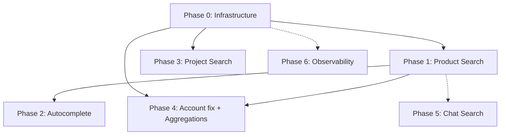

# FurniSpace Elasticsearch Expansion Plan

Kế hoạch mở rộng khai thác Elasticsearch trong backend FurniSpace — từ **search cơ bản cho Account** sang **catalog, project queue, autocomplete, vận hành index** và **observability**.

> **Trạng thái codebase tại thời điểm lập plan:** ES 8.19.15 + Kibana đã có trong `docker-compose.yml`; `ElasticsearchIndexService` chỉ có `IndexAsync` / `DeleteAsync` / `SearchAsync` (QueryString); duy nhất `AccountService` index vào ES; Product/Project vẫn query PostgreSQL (`ILIKE`); chưa có mapping tùy chỉnh, bulk reindex, autocomplete.
>
> **Cập nhật Phase 0 (đã triển khai):** `SearchRequest`/`SearchResult`, `BulkIndexAsync`, `IIndexManager`, mapping `accounts`, `ElasticsearchIndexInitializer`, `ISearchReindexService`, CLI `reindex accounts`, account search pagination native qua ES.
>
> **Cập nhật Phase 1 (đã triển khai):** `ProductSearchDocument`, mapping `products`, `IProductSearchIndexer`, `GET /products/search`, index sync sau Product/ProductVersion write, `reindex products`, fallback PostgreSQL.
>
> **Cập nhật Phase 2 (đã triển khai):** `search_as_you_type` trên `productName.sayt`, synonym analyzer inline trong mapping, autocomplete qua `MultiMatch` (`BoolPrefix`), `GET /products/suggest`, `GET /products/{id}/similar` (More Like This), fallback PostgreSQL. **Chưa làm:** file `synonyms.txt` riêng, Completion suggest API (`SuggestAsync` vẫn stub). **Đã bổ sung 2.4:** `GET /admin/accounts/suggest`.
>
> **Cập nhật Phase 3 (đã triển khai):** `ProjectSearchDocument` denormalized (customer name/email/phone), mapping `projects`, `IProjectSearchIndexer`, index sync sau project write, `ProjectService.GetListAsync` dùng ES khi có `Search` (fallback PostgreSQL), CLI `reindex projects`.
>
> **Cập nhật Phase 4 (đã triển khai):** `includeDeleted` filter native ES (`deletedAt` NotExists), `AccountElasticsearchQueryFactory`, `GET /admin/accounts/search-stats` (terms agg status + roleId), product search trả `facets` (categories/materials/colors), `AggregateAsync` + `SearchRequest.FacetFields`.
>
> **Cập nhật Phase 5 (đã triển khai):** Index `chat-messages` + `project-files`, `IChatMessageSearchIndexer` / `IProjectFileSearchIndexer`, sync sau gửi tin nhắn / upload file, `GET /projects/{projectId}/chat-messages/search`, `GET /projects/{projectId}/files/search`, CLI `reindex chat-messages` / `reindex project-files`, fallback PostgreSQL.
>
> **Cập nhật Phase 6 (đã triển khai phần cốt lõi):** `Serilog.Sinks.Elasticsearch`, cấu hình `ElasticsearchLogging:Enabled` + `IndexFormat`, sink ghi vào index `furnispace-logs-{yyyy.MM}` khi bật. **Chưa làm (vận hành):** Kibana dashboard (6.3), ILM retention (6.4), Elastic APM agent (6.5).

**Tài liệu liên quan:**

- [backend-api-dev-guide.md](./backend-api-dev-guide.md) — quy ước layer, DI, không gọi ES trực tiếp từ Application
- [elasticsearch-docker-guide.md](./elasticsearch-docker-guide.md) — Docker, env, mapping gợi ý cho catalog
- [implementation-roadmap-plan.md](./implementation-roadmap-plan.md) — Data Consistency cross-store (liên quan Phase reindex)

---

## Mục lục

- [1. Hiện trạng và nguyên tắc](#1-hiện-trạng-và-nguyên-tắc)
- [2. Ma trận tính năng](#2-ma-trận-tính-năng)
- [3. Phase 0 — Nền tảng Search Infrastructure](#3-phase-0--nền-tảng-search-infrastructure)
- [4. Phase 1 — Product Catalog Search](#4-phase-1--product-catalog-search)
- [5. Phase 2 — Autocomplete & Search UX](#5-phase-2--autocomplete--search-ux)
- [6. Phase 3 — Project Queue Search](#6-phase-3--project-queue-search)
- [7. Phase 4 — Cải thiện Account Search & Aggregations](#7-phase-4--cải-thiện-account-search--aggregations)
- [8. Phase 5 — Chat / Metadata Search (tùy chọn)](#8-phase-5--chat--metadata-search-tùy-chọn)
- [9. Phase 6 — Observability (ELK / APM)](#9-phase-6--observability-elk--apm)
- [10. Thứ tự triển khai gợi ý](#10-thứ-tự-triển-khai-gợi-ý)
- [11. Rủi ro và giới hạn](#11-rủi-ro-và-giới-hạn)
- [Phụ lục — File mới / sửa tổng hợp](#phụ-lục--file-mới--sửa-tổng-hợp)

---

# 1. Hiện trạng và nguyên tắc

## 1.1 Đã có

| Thành phần | Chi tiết |
|------------|----------|
| Hạ tầng | `elasticsearch` + `kibana` trong `docker-compose.yml` |
| Client | `Elastic.Clients.Elasticsearch` — singleton `ElasticsearchClient` |
| Abstraction | `ISearchIndexService` → `ElasticsearchIndexService` |
| Sử dụng thực tế | `AccountService`: index/delete sau CRUD; search admin account với fallback PostgreSQL |
| Cấu hình | `ElasticsearchSettings` (`Url`, `IndexPrefix`) |

## 1.2 Chưa có / chưa đủ

- Index cho **Product**, **Project**, chat, file metadata
- Mapping/analyzer tùy chỉnh (tiếng Việt, synonym nội thất)
- Pagination/filter/sort native trong ES query (account đang paginate in-memory)
- Bulk index, reindex job, outbox sync
- Autocomplete / suggest API
- Aggregation cho admin dashboard
- Đẩy log Serilog vào ES (Kibana chưa được dùng cho app logs)

## 1.3 Nguyên tắc bắt buộc (theo architecture dự án)

```text
PostgreSQL  = source of truth
Redis       = session, cache, auth state (TTL ngắn)
Elasticsearch = read model / search index (eventually consistent)
```

- Ghi DB **thành công trước**, index ES sau (best-effort, không rollback transaction nếu index fail).
- Không index field nhạy cảm: password hash, token, payment full detail.
- ES client và query detail nằm trong **Infrastructure**; Application chỉ gọi contract (`ISearchIndexService` hoặc wrapper mở rộng).
- Index **read model / DTO search**, không index EF entity trực tiếp.

---

# 2. Ma trận tính năng

| # | Tính năng ES | Module FurniSpace | Ưu tiên | Phase | Effort |
|---|-------------|-------------------|---------|-------|--------|
| A | Mở rộng search contract (filter, pagination, bulk) | Infrastructure | Cao | 0 | TB |
| B | Index manager + mapping | Infrastructure | Cao | 0 | TB |
| C | Product catalog search + filter/sort | Products, 3D picker | Cao | 1 | Cao |
| D | Bulk reindex CLI/job | Ops, consistency | Cao | 0–1 | TB |
| E | Autocomplete (suggest) | Catalog, Admin | Cao | 2 | TB |
| F | Custom analyzer + synonym | Toàn search | Cao | 1–2 | TB |
| G | Project queue search | Projects (Sales/Designer) | TB | 3 | TB |
| H | Account search pagination native | Accounts (Admin) | TB | 4 | Thấp |
| I | Aggregations (facets, dashboard) | Admin | TB | 4 | TB |
| J | More Like This (sản phẩm tương tự) | 3D module | TB | 2 | Thấp |
| K | Chat / file metadata search | ProjectChat, Files | Thấp | 5 | TB |
| L | Centralized logging (Serilog → ES) | Ops | Thấp | 6 | TB |
| M | Elastic APM | Ops | Thấp | 6 | TB |
| N | Geo search (delivery) | Delivery (tương lai) | Tương lai | — | TB |
| O | Vector / semantic search | AI catalog (tương lai) | Tương lai | — | Cao |

**Chú thích effort:** Thấp ≈ 1–3 ngày; TB ≈ 3–7 ngày; Cao ≈ 1–2 sprint.

---

# 3. Phase 0 — Nền tảng Search Infrastructure

## Mục tiêu

Chuẩn hóa abstraction search trước khi thêm index mới; tránh lặp lại pattern pagination in-memory như `AccountService` hiện tại.

## Hạng mục

| ID | Hạng mục | Mô tả |
|----|----------|--------|
| 0.1 | `SearchRequest` / `SearchResult<T>` | Model trong `Infrastructure/Common/Search`: `Query`, `Filters` (term/range), `Sort`, `Page`, `PageSize`, `TrackTotalHits` |
| 0.2 | Mở rộng `ISearchIndexService` | Thêm `SearchAsync(SearchRequest)`, `BulkIndexAsync`, `SuggestAsync` (stub Phase 2) |
| 0.3 | `IIndexManager` | `EnsureIndexAsync(indexName, mappingJson)`, `IndexExistsAsync`, `DeleteIndexAsync` (dev/test) |
| 0.4 | Index naming | Giữ quy ước `{IndexPrefix}-{module}` — ví dụ `furnispace-accounts`, `furnispace-products` |
| 0.5 | Startup ensure index | Gọi `EnsureIndexAsync` cho các index đã định nghĩa mapping (optional, có thể lazy ở request đầu) |
| 0.6 | Reindex CLI | `dotnet run --project src/FurniSpace.API -- reindex --module accounts|products|projects` hoặc hosted service one-shot |
| 0.7 | Unit test Infrastructure | Fake `ElasticsearchClient` khó — test `BuildIndexName`, request builder, mapping loader; integration test ES optional (Testcontainers) |

## Phạm vi hoạt động

- `FurniSpace.Infrastructure/Search/`
- `FurniSpace.Infrastructure/Interfaces/`
- `DependencyInjection.cs` — đăng ký `IIndexManager`

## Tác động

| Mức | Thành phần | Tác động |
|-----|------------|----------|
| Trung bình | `ISearchIndexService` | Breaking change nhẹ — cập nhật fake trong tests |
| Thấp | Application | Chưa đổi behavior user-facing nếu Account giữ API cũ tạm thời |
| Cao (dài hạn) | Mọi module search sau | Nền tảng thống nhất, giảm duplicate query logic |

## Input / Output

| Input | Output |
|-------|--------|
| `ElasticsearchIndexService` hiện tại | Contract mở rộng + implementation |
| Mapping JSON cho `accounts` | Index tạo tự động với field `keyword` cho sort/filter |
| PostgreSQL data | Reindex CLI rebuild `accounts` index |

---

# 4. Phase 1 — Product Catalog Search

## Mục tiêu

Cho phép tìm kiếm và lọc danh mục nội thất — use case cốt lõi của FurniSpace và module thiết kế 3D.

## Search document (read model)

```csharp
// Infrastructure/Common/Search/Documents/ProductSearchDocument.cs
public sealed record ProductSearchDocument(
    Guid ProductId,
    Guid? CategoryId,
    string? CategoryName,
    string? ProductCode,
    string ProductName,
    string? Description,
    string? Material,
    string? Color,
    decimal? Width,
    decimal? Height,
    decimal? Depth,
    decimal? EstimatedPrice,
    string Status,
    bool IsPublic,
    DateTime? CreatedAt);
```

**Nguồn dữ liệu:** join `Product` + default/public `ProductVersion` + `Category` (logic tương tự `ProductRepository.BuildProductListQuery`).

## Mapping gợi ý

| Field | ES type | Ghi chú |
|-------|---------|---------|
| `productId` | `keyword` | Document id |
| `productName` | `text` + `keyword` subfield | Full-text + sort exact |
| `description` | `text` | |
| `categoryName`, `material`, `color`, `status` | `keyword` | Filter facet |
| `estimatedPrice`, `width`, `height`, `depth` | `double` | Range filter/sort |
| `isPublic` | `boolean` | Filter catalog công khai |
| `createdAt` | `date` | Sort |

File mapping: `Infrastructure/Search/Mappings/products-index.json`

## API đề xuất

| Route | Permission | Mô tả |
|-------|------------|--------|
| `GET /Products/search` | Public (chỉ `isPublic`) | `q`, `categoryId`, `material`, `color`, `minPrice`, `maxPrice`, `sort`, `page`, `limit` |
| (internal) | — | Index sau `ProductService` / `ProductVersionService` create/update/delete |

## Luồng đồng bộ

```text
ProductVersion create/update (public ACTIVE)
  → SaveChanges PostgreSQL
  → Build ProductSearchDocument
  → ISearchIndexService.IndexAsync("products", productId, doc)
  → fail → log warning, không rollback

Product delete / unpublish
  → DeleteAsync hoặc re-index với isPublic=false
```

## Phạm vi hoạt động

- `ProductService`, `ProductVersionService` — hook index sau write
- `ProductsController` — endpoint search mới
- `ProductRepository` — fallback `ILIKE` khi ES unavailable (giống Account)

## Tác động

| Mức | Mô tả |
|-----|--------|
| Cao — UX | Module 3D có thể gọi search thay vì load full list |
| Cao — Performance | Giảm full table scan PostgreSQL khi catalog > vài nghìn SKU |
| Trung bình — Code | Service + DTO + controller + index sync |
| Thấp — DB | Không đổi schema PostgreSQL |

## Test

- Unit: `ProductService` search fallback, validation pagination
- Integration (optional): index + query trên Testcontainers ES
- Manual: Kibana Dev Tools verify query

---

# 5. Phase 2 — Autocomplete & Search UX ✅ (đã triển khai)

## Mục tiêu

Gợi ý khi user gõ trong thanh tìm kiếm catalog và admin.

## Trạng thái triển khai

| ID | Hạng mục | Trạng thái | Ghi chú |
|----|----------|------------|---------|
| 2.1 | Completion / SAYT field | ✅ | `productName.sayt` (`search_as_you_type`) trong `products-index.json` |
| 2.2 | Autocomplete query | ✅ | `SearchRequest.AutocompleteText` + `MultiMatch` (`BoolPrefix`) trong `ElasticsearchQueryBuilder` — **không** dùng Completion Suggest API |
| 2.3 | API suggest | ✅ | `GET /products/suggest?q=ban&limit=10` |
| 2.4 | Account suggest | ⏸ | Chưa triển khai (optional) |
| 2.5 | Synonym filter | ✅ | Inline trong mapping JSON (`ban,table`, `ghe,chair`, …) — chưa tách `synonyms.txt` |
| 2.6 | More Like This | ✅ | `GET /products/{id}/similar` — MLT trên `description`, `material`, `categoryName` |

**Sau deploy mapping mới:** xóa index `products` hoặc chạy `dotnet run --project src/FurniSpace.API -- reindex products`.

## Hạng mục (spec gốc)

| ID | Hạng mục | Mô tả |
|----|----------|--------|
| 2.1 | Completion field | Thêm `suggest` field (`completion` type) hoặc `search_as_you_type` trên `productName` |
| 2.2 | `SuggestAsync` | Implementation trong `ElasticsearchIndexService` |
| 2.3 | API | `GET /Products/suggest?q=ban&limit=10` |
| 2.4 | Account suggest | `GET /Accounts/suggest` (admin) — tùy chọn |
| 2.5 | Synonym filter | `synonyms.txt`: bàn/table, ghế/chair, gỗ/wood — gắn analyzer catalog |
| 2.6 | More Like This | `GET /Products/{id}/similar` — dùng MLT trên description/material/category |

## Phạm vi hoạt động

- Catalog UI, module 3D furniture picker
- Admin account list (optional)

## Tác động

- Giảm latency perceived (suggest nhẹ hơn full search)
- Cải thiện relevance tiếng Việt / song ngữ
- Gợi ý sản phẩm thay thế trong scene 3D

## Phụ thuộc

- **Bắt buộc:** Phase 1 (product index)
- Mapping Phase 1 cần thiết kế sẵn field suggest để tránh reindex lần 2 (hoặc chấp nhận reindex sau Phase 2)

---

# 6. Phase 3 — Project Queue Search ✅ (đã triển khai)

## Mục tiêu

Thay `ILIKE` + subquery join Account trong `ProjectRepository` bằng index denormalized khi project queue lớn.

## Trạng thái triển khai

| Hạng mục | Trạng thái | Ghi chú |
|----------|------------|---------|
| `ProjectSearchDocument` + mapping | ✅ | Denormalize customer từ Account lúc index |
| Index sync | ✅ | Sau create/update/assign/status/reject |
| `GetListAsync` ES path | ✅ | Chỉ khi `Search` không rỗng; filter role qua term |
| Fallback PostgreSQL | ✅ | `BuildProjectQueueQuery` giữ nguyên |
| CLI reindex | ✅ | `dotnet run --project src/FurniSpace.API -- reindex projects` |

**Lưu ý:** Customer đổi tên/email → eventual consistency; chạy `reindex projects` nếu cần đồng bộ ngay.

## Search document (spec gốc)

```csharp
public sealed record ProjectSearchDocument(
    Guid ProjectId,
    string? ProjectCode,
    string ProjectName,
    string Status,
    Guid CustomerId,
    string CustomerName,
    string CustomerEmail,
    string? CustomerPhone,
    Guid? AssignedSalesId,
    Guid? AssignedDesignerId,
    DateTime? CreatedAt);
```

## Luồng

- Index khi project create/update/assign
- Denormalize customer name/email từ `Account` lúc index (chấp nhận eventual consistency khi customer đổi tên — reindex hoặc update partial)
- `ProjectService.GetListAsync`: nếu có `Search` → query ES; filter role (Sales/Designer) qua `term` filter

## Phạm vi hoạt động

- Sales / Designer / Admin project queue
- `ProjectRepository.BuildProjectQueueQuery` — giữ làm fallback

## Tác động

| Mức | Mô tả |
|-----|--------|
| Trung bình — Performance | Bỏ correlated subquery Account khi search |
| Trung bình — UX | Fuzzy match typo mã dự án / tên khách |
| Thấp — Phase sớm | Chưa cần thiết nếu < ~500 project; có thể defer |

---

# 7. Phase 4 — Cải thiện Account Search & Aggregations ✅ (đã triển khai)

## Mục tiêu

Sửa technical debt pagination in-memory; thêm facet cho admin.

## Trạng thái triển khai

| ID | Hạng mục | Trạng thái | Ghi chú |
|----|----------|------------|---------|
| 4.1 | Refactor `SearchAccountsAsync` | ✅ | `AccountElasticsearchQueryFactory`; filter `deletedAt` NotExists khi `includeDeleted=false` |
| 4.2 | Account mapping | ✅ | Đã có từ Phase 0 (`email`, `fullName`, `phone` text+keyword; không index password) |
| 4.3 | Aggregation API | ✅ | `GET /admin/accounts/search-stats?includeDeleted=false` — fallback PostgreSQL GROUP BY |
| 4.4 | Product facets | ✅ | `GET /products/search` trả `facets: { categories, materials, colors }` khi ES path |

## Hạng mục (spec gốc)

| ID | Hạng mục | Mô tả |
|----|----------|--------|
| 4.1 | Refactor `SearchAccountsAsync` | Dùng `SearchRequest` với filter `status`, `includeDeleted`, sort, `from/size`, `track_total_hits` |
| 4.2 | Account mapping | `email`, `fullName`, `phone` — text + keyword; không index password |
| 4.3 | Aggregation API | `GET /Admin/search-stats` hoặc embed trong list: count theo `status`, `role` |
| 4.4 | Product facets | `GET /Products/search` trả thêm `facets: { categories, materials, colors }` qua ES aggregation |

## Tác động

- Account list scale đúng khi admin user > vài nghìn
- Admin dashboard không cần nhiều query COUNT(*) PostgreSQL

## Phụ thuộc

- Phase 0 (search contract)
- Phase 1 (cho product facets)

---

# 8. Phase 5 — Chat / Metadata Search (tùy chọn) ✅

## Mục tiêu

Full-text search lịch sử chat và tên file trong project.

## Đã triển khai

| Hạng mục | Chi tiết |
|----------|----------|
| Index | `chat-messages`, `project-files` (mapping JSON + `ElasticsearchIndexInitializer`) |
| Indexer | `ChatMessageSearchIndexer`, `ProjectFileSearchIndexer` — sync sau send message / upload file |
| API | `GET /projects/{projectId}/chat-messages/search?q=&page=&limit=` |
| API | `GET /projects/{projectId}/files/search?q=&page=&limit=` |
| Reindex CLI | `dotnet run --project src/FurniSpace.API -- reindex chat-messages` |
| Reindex CLI | `dotnet run --project src/FurniSpace.API -- reindex project-files` |
| Fallback | PostgreSQL `ILIKE` khi ES lỗi hoặc chưa cấu hình |
| Customer filter (files) | `CUSTOMER_VISIBLE` hoặc file do chính customer upload (`uploadedBy`) |

## Phạm vi gốc

- Index `ProjectChatMessage` (content text, projectId, senderId, createdAt)
- Index file metadata (`StoredFile` / `FileLink`: fileName, referenceType, projectId)

## Khi nào làm

- Khi volume chat/file đủ lớn khiến PostgreSQL `ILIKE` chậm
- Hoặc khi product yêu cầu “tìm trong hội thoại”

## Tác động

- Trung bình — tiện ích Sales/Designer
- Effort TB — index sync theo message create (tần suất cao → cân nhắc batch)

---

# 9. Phase 6 — Observability (ELK / APM) ✅ (core)

## Mục tiêu

Tận dụng Kibana đã có trong Docker cho vận hành.

## Đã triển khai

| ID | Hạng mục | Trạng thái |
|----|----------|------------|
| 6.1 | Serilog sink | ✅ `Serilog.Sinks.Elasticsearch` — bật qua `ElasticsearchLogging:Enabled=true` |
| 6.2 | CorrelationId | ✅ Đã có trong middleware + log enrich |
| 6.3 | Kibana dashboard | ⏳ Cấu hình thủ công trên Kibana (request rate, 5xx, slow requests) |
| 6.4 | ILM policy | ⏳ Retention 30 ngày — tạo policy trên cluster production |
| 6.5 | Elastic APM (optional) | ⏳ Chưa gắn agent .NET |

**Cấu hình mẫu (`appsettings.json`):**

```json
"ElasticsearchLogging": {
  "Enabled": false,
  "IndexFormat": "furnispace-logs-{0:yyyy.MM}"
}
```

Bật `Enabled: true` khi ES URL đã có (dùng chung `Elasticsearch:Url`).

## Hạng mục (spec gốc)

| ID | Hạng mục | Mô tả |
|----|----------|--------|
| 6.1 | Serilog sink | `Serilog.Sinks.Elasticsearch` — index `furnispace-logs-{yyyy.MM}` |
| 6.2 | CorrelationId | Field `@timestamp`, `CorrelationId`, `UserId` — đã có trong middleware |
| 6.3 | Kibana dashboard | Request rate, 5xx, slow requests (`ElapsedMs` >= 1000) |
| 6.4 | ILM policy | Retention 30 ngày log index (production) |
| 6.5 | Elastic APM (optional) | Agent .NET — trace DB/ES/Firebase latency |

## Phạm vi

- Dev/staging: bật ngay
- Production: cần bật security ES + TLS (xem `elasticsearch-docker-guide.md` §13)

## Tác động

- Không đổi business logic
- Cải thiện debug production, liên kết với `CorrelationId` trong error response

## Lưu ý

- **Không** log password, token, OTP, connection string (đã có rule trong backend-api-dev-guide)
- Log index **tách** khỏi business search index

---

# 10. Thứ tự triển khai gợi ý

```text
Sprint 1–2
  Phase 0  → Search contract, IIndexManager, account mapping, reindex CLI
  Phase 1  → Product index + GET /Products/search (MVP filter: q, category, page)

Sprint 3
  Phase 2  → Suggest API + synonym cơ bản
  Phase 4.1 → Fix account pagination (quick win sau Phase 0)

Sprint 4 (khi cần)
  Phase 3  → Project index
  Phase 4.3–4.4 → Facets / admin stats

Sau / optional
  Phase 5  → Chat search
  Phase 6  → ELK + APM
```

## Sơ đồ phụ thuộc



---

# 11. Rủi ro và giới hạn

| Rủi ro | Giảm thiểu |
|--------|------------|
| ES down → search fail | Fallback PostgreSQL (pattern Account hiện có) |
| Index lệch DB | Reindex CLI định kỳ; log index failure; metric `search_index_failures` |
| Mapping change breaking | Version index `products-v2` + reindex + alias swap |
| Pagination in-memory (account) | Fix Phase 4.1 — ưu tiên sau Phase 0 |
| RAM local dev | Giữ `ES_JAVA_OPTS=512m`; không index full chat sớm |
| Sensitive data leak | Review document schema; checklist trước mỗi index mới |

## Không dùng Elasticsearch cho

- Transaction / order / payment source of truth
- JWT, refresh token, session (Redis)
- Cache read model ngắn hạn (Redis đủ)
- Blob / file binary (Firebase Storage)

---

# Phụ lục — File mới / sửa tổng hợp

## Phase 0

| Loại | Path |
|------|------|
| Mới | `Infrastructure/Common/Search/SearchRequest.cs` |
| Mới | `Infrastructure/Common/Search/SearchResult.cs` |
| Mới | `Infrastructure/Common/Search/BulkIndexItem.cs` |
| Mới | `Infrastructure/Interfaces/IIndexManager.cs` |
| Mới | `Infrastructure/Search/ElasticsearchIndexManager.cs` |
| Mới | `Infrastructure/Search/Mappings/accounts-index.json` |
| Mới | `Infrastructure/Search/Reindex/` (CLI handler hoặc command) |
| Sửa | `Infrastructure/Interfaces/ISearchIndexService.cs` |
| Sửa | `Infrastructure/Search/ElasticsearchIndexService.cs` |
| Sửa | `Infrastructure/DependencyInjection.cs` |
| Sửa | `tests/.../FakeSearchIndexService.cs` (mọi nơi implement fake) |

## Phase 1

| Loại | Path |
|------|------|
| Mới | `Infrastructure/Common/Search/Documents/ProductSearchDocument.cs` |
| Mới | `Infrastructure/Search/Mappings/products-index.json` |
| Mới | `Infrastructure/Search/ProductSearchDocumentBuilder.cs` |
| Mới | `Application/DTOs/Products/ProductSearchRequestDto.cs` |
| Mới | `Application/DTOs/Products/ProductSearchResponseDto.cs` |
| Sửa | `Application/Services/Products/ProductService.cs` |
| Sửa | `Application/Services/ProductVersions/ProductVersionService.cs` |
| Sửa | `Application/Interfaces/Products/IProductService.cs` |
| Sửa | `API/Controllers/ProductsController.cs` |
| Mới | `tests/.../ProductSearchTests.cs` |

## Phase 2 ✅

| Loại | Path |
|------|------|
| Sửa | `Infrastructure/Search/Mappings/products-index.json` — synonym analyzer + `productName.sayt` |
| Mới | `Infrastructure/Common/Search/MoreLikeThisRequest.cs` |
| Sửa | `Infrastructure/Common/Search/SearchRequest.cs` — `AutocompleteText`, `AutocompleteFields` |
| Sửa | `Infrastructure/Search/ElasticsearchQueryBuilder.cs` — BoolPrefix autocomplete |
| Sửa | `Infrastructure/Search/ElasticsearchIndexService.cs` — `MoreLikeThisAsync` |
| Sửa | `Infrastructure/Interfaces/ISearchIndexService.cs` — `MoreLikeThisAsync` |
| Mới | `Application/DTOs/Products/ProductSuggestResponseDto.cs`, `ProductSuggestItemDto` |
| Sửa | `Application/Services/Search/ProductElasticsearchQueryFactory.cs` — `BuildSuggest`, `BuildSimilar` |
| Sửa | `Application/Services/Products/ProductService.cs` — `SuggestAsync`, `GetSimilarAsync` |
| Sửa | `Application/Interfaces/Products/IProductService.cs` |
| Sửa | `Infrastructure/Repositories/Repository/ProductRepository.cs` — fallback `SuggestPublicAsync`, `GetSimilarPublicAsync` |
| Sửa | `API/Controllers/ProductsController.cs` — `GET suggest`, `GET similar` |
| Sửa | Tests — fakes + `SuggestAsync_WhenElasticsearchUnavailable_FallsBackToRepository` |

## Phase 3 ✅

| Loại | Path |
|------|------|
| Mới | `Infrastructure/Common/Search/Documents/ProjectSearchDocument.cs` |
| Mới | `Infrastructure/ReadModels/Projects/ProjectSearchIndexItemReadModel.cs` |
| Mới | `Infrastructure/Search/Mappings/projects-index.json` |
| Mới | `Infrastructure/Search/ProjectSearchDocumentMapper.cs` |
| Mới | `Application/Interfaces/Search/IProjectSearchIndexer.cs` |
| Mới | `Application/Services/Search/ProjectSearchIndexer.cs` |
| Mới | `Application/Services/Search/ProjectElasticsearchQueryFactory.cs` |
| Sửa | `Application/Services/Projects/ProjectService.cs` — ES search + index hooks |
| Sửa | `Infrastructure/Repositories/Repository/ProjectRepository.cs` — index queries |
| Sửa | `Application/Services/Search/SearchReindexService.cs` — `ReindexProjectsAsync` |
| Sửa | `API/Program.cs` — CLI `reindex projects` |

## Phase 4 ✅

| Loại | Path |
|------|------|
| Mới | `Infrastructure/Common/Search/SearchFacetBucket.cs`, `SearchAggregationRequest.cs`, `SearchAggregationResult.cs` |
| Sửa | `Infrastructure/Common/Search/SearchRequest.cs` — `FacetFields`; `SearchResult.cs` — `Facets` |
| Mới | `Infrastructure/Search/ElasticsearchAggregationHelper.cs` |
| Sửa | `Infrastructure/Search/ElasticsearchIndexService.cs` — facets trong search + `AggregateAsync` |
| Sửa | `Infrastructure/Interfaces/ISearchIndexService.cs` — `AggregateAsync` |
| Mới | `Application/Services/Search/AccountElasticsearchQueryFactory.cs`, `SearchFacetMapper.cs` |
| Mới | `Application/DTOs/Accounts/AccountSearchStatsDto.cs`, `DTOs/Search/SearchFacetItemDto.cs` |
| Mới | `Application/DTOs/Products/ProductSearchFacetsDto.cs` |
| Sửa | `Application/Services/Accounts/AccountService.cs` — stats + includeDeleted fix |
| Sửa | `Application/Services/Products/ProductService.cs` — facets trong search |
| Sửa | `Application/Services/Search/ProductElasticsearchQueryFactory.cs` — facet fields |
| Sửa | `Infrastructure/Repositories/Repository/AccountRepository.cs` — GROUP BY fallback |
| Sửa | `API/Controllers/AccountsController.cs` — `GET /admin/accounts/search-stats` |

## Phase 6

| Sửa | `Infrastructure/Logging/SerilogConfiguration.cs` |
| Mới | `Infrastructure/Common/Search/ElasticsearchLogSettings.cs` |
| Sửa | `docker-compose.yml` / `.env` — ES security prod notes |

---

## Checklist trước khi merge mỗi phase

- [ ] PostgreSQL vẫn source of truth; index fail không rollback write
- [ ] Không index field nhạy cảm
- [ ] Fallback DB khi ES unavailable (search endpoints)
- [ ] Unit test cập nhật; build + test pass
- [ ] Mapping document trong repo (`Mappings/*.json`)
- [ ] Reindex command documented trong README hoặc `elasticsearch-docker-guide.md`
- [ ] Endpoint mới có route, permission, status codes trong PR description

---

*Tài liệu này bổ sung cho `elasticsearch-docker-guide.md` (hướng dẫn Docker/setup) — tập trung vào **roadmap tính năng** và **tác động codebase**.*
