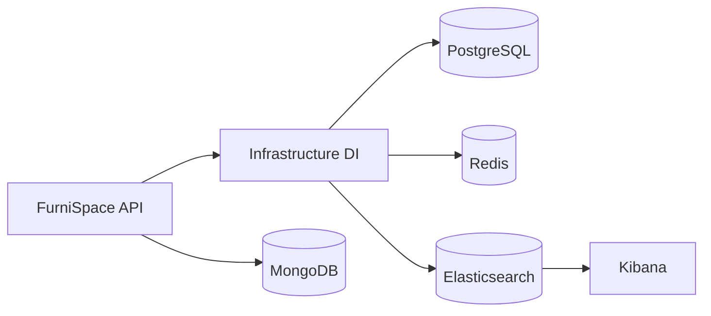
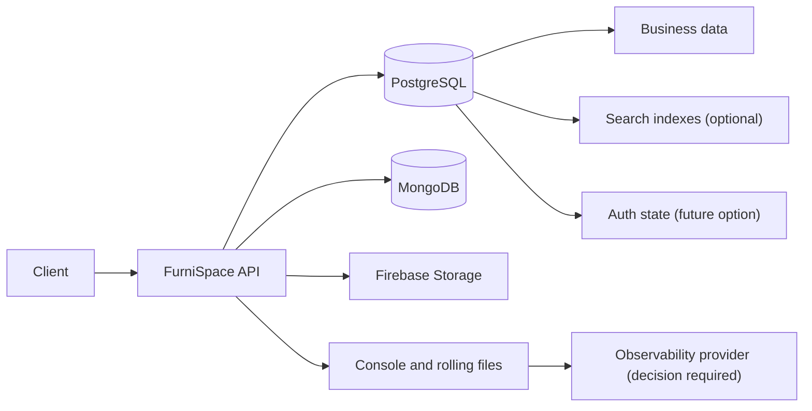

# Đánh giá phương án loại bỏ Redis và Elasticsearch

## 1. Mục tiêu và phạm vi

Tài liệu này đánh giá tác động, rủi ro và lộ trình nếu FurniSpace loại bỏ Redis và/hoặc Elasticsearch khỏi hệ thống.

Phạm vi của giai đoạn hiện tại chỉ gồm:

- Ghi nhận kiến trúc và mức độ phụ thuộc hiện tại.
- So sánh các phương án thay thế.
- Đề xuất lộ trình thử nghiệm, tiêu chí chấp nhận và phương án rollback.
- Cung cấp checklist để team ra quyết định.

Giai đoạn này **không** thay đổi source code, package, cấu hình môi trường, Docker Compose, database schema hay migration.

## 2. Kết luận nhanh

| Thành phần | Vai trò chính hiện tại | Có thể bỏ ngay không? | Mức rủi ro |
| --- | --- | --- | --- |
| Elasticsearch | Tăng chất lượng/tốc độ tìm kiếm và nhận structured logs | Không thể chỉ tắt container; cần sửa DI và chấp nhận giảm chất lượng search | Trung bình — **5/10** |
| Redis | Lưu session, refresh token, JWT revocation, OTP, reset token và rate limit dùng chung | Không. Bỏ mà không có storage thay thế sẽ làm hỏng authentication | Cao — **8/10** |
| Cả hai cùng lúc | Thay đổi đồng thời search, auth, logging và deployment | Không khuyến nghị | Rất cao — **9/10** |

Khuyến nghị:

1. Đánh giá và thử bỏ Elasticsearch trước vì PostgreSQL đã có phần lớn fallback.
2. Không bỏ Redis cho tới khi toàn bộ state bảo mật được chuyển sang một shared durable store.
3. Không triển khai việc bỏ cả hai trong cùng một lần release.

## 3. Kiến trúc và phụ thuộc hiện tại

### 3.1 Điểm phụ thuộc chung

Redis và Elasticsearch đều được đăng ký trong `src/FurniSpace.Infrastructure/DependencyInjection.cs`.

Hiện tại:

- Thiếu Redis connection string sẽ phát sinh `InvalidOperationException`.
- Thiếu Elasticsearch URL cũng sẽ phát sinh `InvalidOperationException`.
- `docker-compose.yml` yêu cầu Redis và Elasticsearch healthy trước khi khởi động API.
- Vì vậy, chỉ xóa environment variable hoặc dừng container sẽ khiến deployment không khởi động bình thường.

Luồng phụ thuộc tổng quát:

### 3.2 Elasticsearch đang được dùng ở đâu

PostgreSQL vẫn là source of truth. Elasticsearch chỉ giữ search document được đồng bộ từ dữ liệu nghiệp vụ.

Các logical index hiện có:

- `accounts`
- `products`
- `projects`
- `chat-messages`
- `project-files`

Các luồng đọc sử dụng Elasticsearch:

- Product search, suggest và similar products.
- Admin account search, suggest và search statistics.
- Project list khi có search keyword.
- Project chat message search.
- Project file search.

Các luồng ghi:

- Account, product, project, chat message và project file được đồng bộ sang search index sau thay đổi.
- Phần lớn index write là best-effort: lỗi index không rollback transaction PostgreSQL.
- Có reindex CLI cho từng module.

Các thành phần chính:

- `src/FurniSpace.Infrastructure/Common/Search/Elasticsearch/`
- `src/FurniSpace.Infrastructure/Common/Search/Mappings/`
- `src/FurniSpace.Application/Services/Search/`
- `src/FurniSpace.Infrastructure/Interfaces/ISearchIndexService.cs`
- `src/FurniSpace.Infrastructure/Interfaces/IIndexManager.cs`
- Reindex command trong `src/FurniSpace.API/Program.cs`

Ngoài search nghiệp vụ, Elasticsearch còn nhận log qua `Serilog.Sinks.Elasticsearch` khi `ElasticsearchLogging:Enabled=true`. Nếu bỏ Elasticsearch, console và rolling file logs vẫn hoạt động, nhưng Kibana/searchable centralized logs sẽ không còn nếu chưa có giải pháp thay thế.

### 3.3 PostgreSQL fallback đã có cho search

Các service hiện đã có fallback khi Elasticsearch lỗi:

- Products: repository search, suggest và similar-product heuristic.
- Accounts: paged database search và PostgreSQL aggregate.
- Projects: repository list/search.
- Project chat messages: `ILIKE` trên nội dung.
- Project files: `ILIKE` trên tên file.

Điều này làm giảm rủi ro mất chức năng cơ bản. Tuy nhiên fallback không đồng nghĩa với tương đương hoàn toàn:

- Product fallback hiện có thể phải load/filter nhiều dữ liệu trong memory.
- Facet theo category/material/color không đầy đủ như Elasticsearch.
- Không có analyzer và synonym tương đương.
- Suggestion và ranking đơn giản hơn.
- Similar products dùng heuristic, không phải More Like This.
- Các truy vấn `%keyword%` có thể chậm khi dữ liệu tăng nếu chưa có trigram/full-text index.

### 3.4 Redis đang được dùng ở đâu

Toàn bộ Redis access đi qua `ICacheService`, hiện được implement bởi `RedisCacheService`.

Các chức năng bảo mật phụ thuộc Redis:

- Refresh token và token lookup.
- Rotate/consume refresh token.
- JWT blacklist khi logout.
- Mốc revoke toàn bộ access token của một user.
- Email OTP dùng một lần.
- Password-reset token dùng một lần.
- Rate limit theo email cho register, login, OTP và reset password.

Các chức năng cache hiệu năng:

- Account detail cache.
- Account list cache.

Các thành phần chính:

- `src/FurniSpace.Infrastructure/Interfaces/ICacheService.cs`
- `src/FurniSpace.Infrastructure/Caching/RedisCacheService.cs`
- `src/FurniSpace.Application/Services/Identity/RefreshTokenStore.cs`
- `src/FurniSpace.Application/Services/Identity/EmailOtpStore.cs`
- `src/FurniSpace.Application/Services/Identity/PasswordResetStore.cs`
- `src/FurniSpace.Application/Services/Identity/IdentityService.cs`
- `src/FurniSpace.Application/Services/Accounts/AccountService.cs`

### 3.5 Những thành phần không dùng Redis

- SignalR hiện không đăng ký Redis backplane.
- HTTP rate limiter `auth-public` là in-memory, tách biệt với rate limit theo email trong Redis.
- PostgreSQL, MongoDB, Firebase Storage và các payment provider không phụ thuộc Redis.

Do đó, bỏ Redis không ảnh hưởng trực tiếp tới SignalR khi ứng dụng chỉ chạy một instance. Nếu scale nhiều API instance, SignalR hiện tại vẫn cần một backplane khác bất kể quyết định trong tài liệu này.

## 4. Đánh giá tác động và rủi ro

### 4.1 Loại bỏ Elasticsearch — 5/10

Tác động bắt buộc phải xử lý:

- API không khởi động nếu chỉ xóa Elasticsearch URL.
- Một số application service yêu cầu `ISearchIndexService` trong constructor.
- Hosted index initializer và reindex CLI không còn hợp lệ.
- API service trong Docker Compose vẫn chờ Elasticsearch healthcheck.
- Kibana và Elasticsearch log sink phải được bỏ hoặc thay thế.

Tác động tới người dùng:

- Search cơ bản vẫn có thể hoạt động bằng PostgreSQL fallback.
- Ranking, synonyms, autocomplete, facets và similar-product quality có thể giảm.
- Latency và database load có thể tăng khi catalog, message hoặc file data lớn.

Tác động dữ liệu:

- Không mất business data vì PostgreSQL là source of truth.
- Search indices có thể dựng lại từ PostgreSQL khi rollback.
- Không cần migration nếu chỉ chấp nhận fallback hiện tại.
- Sẽ cần migration nếu chọn PostgreSQL trigram/full-text search để bảo đảm hiệu năng.

Các rủi ro chính:

1. Product search chậm dần theo kích thước catalog.
2. Kết quả search khác Elasticsearch, gây regression khó phát hiện bằng status code.
3. Mất facets hoặc UI nhận response thiếu dữ liệu mong đợi.
4. Mất centralized log search nếu chưa thay Kibana.
5. Xóa code quá sớm làm rollback phức tạp.

### 4.2 Loại bỏ Redis — 8/10

Tác động bắt buộc phải xử lý:

- API không khởi động nếu chỉ xóa Redis connection.
- Login có thể tạo access token nhưng không thể duy trì refresh session đúng cách.
- Refresh, logout, JWT revocation, OTP và password reset bị lỗi.
- Password change, account deactivate hoặc forced logout không thể revoke session đúng semantics.
- Rate limit theo email bị mất, làm tăng nguy cơ brute force và abuse.

Tác động hiệu năng:

- Bỏ account DTO cache chỉ làm tăng PostgreSQL reads và có thể chấp nhận được.
- Chuyển revocation lookup sang PostgreSQL làm mọi authenticated request có thêm database query nếu giữ cách kiểm tra hiện tại.

Tác động bảo mật:

- In-memory replacement không chia sẻ state giữa nhiều replica.
- Restart ứng dụng làm mất session, OTP, reset token và rate-limit counters.
- Bỏ blacklist có thể khiến token đã logout vẫn hợp lệ cho đến khi access token hết hạn.
- Thiết kế consume token phải atomic để chống refresh-token replay và OTP reuse.

Các rủi ro chính:

1. Authentication outage.
2. Session/revocation semantics không còn chính xác.
3. Race condition khi refresh hoặc consume token.
4. Rate limit không đồng nhất giữa các API instance.
5. Tăng load PostgreSQL trên critical request path.
6. Migration và dual-write không tương thích ngược.

### 4.3 Loại bỏ cả hai — 9/10

Không khuyến nghị thực hiện trong một release vì:

- Blast radius trải rộng qua auth, search, logging, DI, Docker và deployment.
- Search regression và auth regression sẽ khó cô lập nguyên nhân.
- Rollback phải phục hồi nhiều service và config cùng lúc.
- Team phải đánh giá đồng thời schema migration và search behavior changes.
- Test hiện không chạy Redis/Elasticsearch thật trong CI, nên staging sẽ gánh phần lớn validation.

## 5. Các phương án cho Elasticsearch

### Phương án ES-A: Dùng trực tiếp fallback hiện tại

Mô tả:

- Bỏ ES-first path và gọi PostgreSQL repository trực tiếp.
- Không thêm database search extension trong giai đoạn đầu.

Ưu điểm:

- Ít thay đổi schema.
- Không có migration.
- Giảm chi phí vận hành Elasticsearch và Kibana.
- Có thể thử nhanh trên staging.

Nhược điểm:

- Product search có nguy cơ scan/load nhiều dữ liệu.
- Search quality thấp hơn.
- Facet, synonyms và relevance không tương đương.

Phù hợp khi:

- Dữ liệu nhỏ.
- Search không phải tính năng cốt lõi.
- Team chấp nhận đơn giản hóa UI/response.

### Phương án ES-B: PostgreSQL full-text search và `pg_trgm`

Mô tả:

- Dùng GIN/trigram index cho partial search.
- Dùng PostgreSQL full-text search và ranking cho nội dung phù hợp.
- Tính facets bằng SQL aggregate.

Ưu điểm:

- Loại bỏ external search service nhưng vẫn giữ search server-side.
- Multi-instance safe.
- Dữ liệu search nhất quán trực tiếp với source of truth.

Nhược điểm:

- Cần migration.
- Cần tuning query/index và benchmark.
- Vietnamese synonym/analyzer cần thiết kế riêng.
- PostgreSQL phải chịu thêm search workload.

Phù hợp khi:

- Catalog/message/file data ở mức vừa.
- Team muốn giảm hạ tầng nhưng vẫn giữ search quality đủ tốt.

### Phương án ES-C: Giữ Elasticsearch có chọn lọc

Mô tả:

- Chỉ dùng Elasticsearch cho product/catalog search.
- Chuyển account, project, chat và file search về PostgreSQL.
- Tách log shipping khỏi business search.

Ưu điểm:

- Giữ tính năng search có giá trị nhất.
- Giảm số lượng index và write-side synchronization.

Nhược điểm:

- Vẫn phải vận hành Elasticsearch.
- Ops saving thấp hơn việc loại bỏ hoàn toàn.
- Kiến trúc hybrid vẫn có độ phức tạp.

Phù hợp khi:

- Product discovery là tính năng quan trọng.
- Search quality regression không được chấp nhận.

### Khuyến nghị Elasticsearch

Bắt đầu bằng ES-A dưới feature flag trên staging để thu thập baseline. Nếu latency hoặc quality không đạt, chuyển sang ES-B. Chỉ xóa package/indexer/compose service sau khi PostgreSQL-only mode vượt qua thời gian soak.

## 6. Các phương án cho Redis

### Phương án Redis-A: Tiếp tục giữ Redis

Ưu điểm:

- Ít rủi ro nhất.
- Phù hợp với token TTL, atomic consume, counter và shared state.
- Không thêm auth traffic vào PostgreSQL.

Nhược điểm:

- Tiếp tục có external dependency.
- Cần monitor memory, persistence, availability và key cleanup.

Đây là lựa chọn mặc định cho tới khi có lý do vận hành đủ lớn để thay Redis.

### Phương án Redis-B: Chuyển auth state sang PostgreSQL

Các nhóm dữ liệu cần thiết kế:

- Refresh token và lookup.
- Access-token blacklist.
- User-level revoked-before timestamp.
- OTP.
- Password-reset token.
- Rate-limit counter và window.

Yêu cầu kỹ thuật:

- Chỉ lưu token hash, không lưu raw secret.
- Có `expires_at` và index phục vụ cleanup.
- Consume token/OTP phải dùng atomic `DELETE ... RETURNING` hoặc transaction tương đương.
- Refresh-token replay detection phải giữ đúng semantics hiện tại.
- Có background cleanup hoặc scheduled cleanup.
- Có index phù hợp cho JWT revocation lookup trên mọi authenticated request.

Ưu điểm:

- Một source hạ tầng ít hơn.
- Durable qua restart.
- Shared state hoạt động với nhiều replica.

Nhược điểm:

- Bắt buộc có database migration.
- Tăng auth traffic và contention trên PostgreSQL.
- Cần dual-write/backfill strategy.
- Phải load test và security-test kỹ.

### Phương án Redis-C: In-memory storage

Chỉ phù hợp cho local development hoặc test.

Không chấp nhận cho production nếu:

- Có hoặc sẽ có nhiều API replica.
- Cần session tồn tại sau restart.
- Cần revoke/logout nhất quán.
- Rate limiting là yêu cầu bảo mật.

### Phương án Redis-D: Hybrid

Mô tả:

- Chuyển auth/security state sang PostgreSQL.
- Bỏ account cache hoặc thay bằng local memory cache ngắn hạn.

Đây là phương án loại bỏ Redis hợp lý nhất vì cache account vốn đã best-effort, trong khi auth state cần durable shared storage.

### Khuyến nghị Redis

Không bỏ Redis ở thời điểm hiện tại. Nếu team quyết định loại bỏ, chọn Redis-D và triển khai PostgreSQL auth store qua feature flag + dual-write. Không dùng in-memory làm production fallback.

## 7. Kiến trúc mục tiêu đề xuất

Thứ tự chuyển đổi đề xuất:

1. Elasticsearch trở thành optional.
2. Chạy PostgreSQL-only search trên staging.
3. Chốt có cần PostgreSQL FTS/trigram hay không.
4. Tách quyết định logging/observability khỏi business search.
5. Thiết kế PostgreSQL auth store.
6. Dual-write Redis + PostgreSQL.
7. Chuyển read path sang PostgreSQL.
8. Soak, xác nhận rollback và mới dừng Redis.

## 8. Lộ trình triển khai theo giai đoạn

### Giai đoạn 0: Baseline và quyết định

Không thay đổi behavior.

Cần thu thập:

- Số lượng product, account, project, chat message và project file.
- Search requests/phút và query phổ biến.
- p50, p95, p99 của từng search endpoint.
- Tỷ lệ query có facets/suggest/similar.
- Auth requests/phút.
- Số API replica hiện tại và kế hoạch scale.
- Redis memory/key count và PostgreSQL headroom.
- Yêu cầu giữ session qua restart.

### Giai đoạn 1: Làm Elasticsearch optional

Mục tiêu:

- API có thể khởi động khi Elasticsearch disabled.
- Read path dùng PostgreSQL trực tiếp.
- Index initializer, index write và reindex CLI được gate.
- Elasticsearch logging được disable độc lập.

Triển khai bằng feature flag, mặc định vẫn bật ở production trong release đầu.

Không xóa Elasticsearch container hoặc code trong giai đoạn này.

### Giai đoạn 2: PostgreSQL-only search trên staging

Thực hiện:

- Chạy fixed query set trên ES và PostgreSQL.
- So sánh IDs, total, facets, ordering và response shape.
- Load test các endpoint search.
- Theo dõi PostgreSQL CPU, connections, slow queries và memory.
- Xác nhận console/file logging đủ cho vận hành hoặc chọn observability replacement.

Thời gian soak khuyến nghị: tối thiểu 7 ngày với traffic đại diện.

### Giai đoạn 3: Dọn Elasticsearch

Chỉ thực hiện khi Giai đoạn 2 đạt tiêu chí.

Phạm vi dự kiến:

- Xóa ES/Kibana services và volumes khỏi Docker Compose.
- Xóa environment variables và API `depends_on`.
- Xóa Elasticsearch client, mappings, initializer, indexers và reindex CLI.
- Xóa các package Elasticsearch không còn dùng.
- Cập nhật integration fakes, unit tests và docs.
- Giữ backup/config rollback trong ít nhất một release.

### Giai đoạn 4: Thiết kế PostgreSQL auth store

Đây là project riêng, cần review bảo mật và migration review.

Deliverables:

- Schema và TTL cleanup strategy.
- Atomic consume/revoke design.
- Repository hoặc `ICacheService` implementation.
- Feature flag chọn Redis/PostgreSQL.
- Dual-write behavior và reconciliation.
- Dashboard cho auth errors, refresh replay và rate-limit behavior.

### Giai đoạn 5: Dual-write và chuyển Redis read path

Thứ tự:

1. Ghi đồng thời Redis và PostgreSQL.
2. Vẫn đọc Redis, so sánh PostgreSQL ở background/telemetry.
3. Chuyển read sang PostgreSQL, giữ Redis làm fallback.
4. Soak tối thiểu 7–14 ngày.
5. Dừng Redis trên staging trước production.

### Giai đoạn 6: Dọn Redis

Chỉ thực hiện sau khi auth matrix và load test đạt yêu cầu:

- Xóa Redis DI và package.
- Xóa Redis health endpoint/config.
- Xóa container, volume và environment variables.
- Bỏ dual-write sau một release ổn định.
- Cập nhật tài liệu vận hành và incident runbook.

## 9. Tiêu chí chấp nhận

### 9.1 Elasticsearch

API startup:

- API khởi động thành công khi không có Elasticsearch URL.
- Không có retry loop hoặc startup warning spam.

Tính đúng:

- Tất cả search endpoint trả đúng response contract.
- Fixed query set có kết quả phù hợp với business expectation.
- UI không phụ thuộc facet hoặc field đã mất.

Hiệu năng đề xuất:

- p95 PostgreSQL-only search không vượt quá 1.5 lần baseline ES.
- p99 không vượt quá 2 lần baseline ES.
- Không endpoint nào thường xuyên vượt ngưỡng warning 1 giây.
- PostgreSQL CPU và connection utilization còn headroom tối thiểu 30%.

Observability:

- Request/error logs vẫn truy vấn được bằng giải pháp đã chọn.
- Correlation ID và trace context được giữ.
- Không còn Elasticsearch sink error.

### 9.2 Redis

Auth lifecycle:

- Register → OTP verify → login → refresh → logout hoạt động end-to-end.
- Forgot password → reset → login lại hoạt động.
- Refresh token chỉ consume một lần.
- Concurrent refresh không phát hành hai session hợp lệ.
- Logout/revoke làm access token bị từ chối đúng thời điểm.
- Password change/deactivate account revoke toàn bộ session.
- Expired OTP/reset/refresh token luôn bị từ chối.

Multi-instance:

- State nhất quán giữa tối thiểu hai API instance.
- Rate limit không thể bypass bằng cách chuyển instance.

Hiệu năng đề xuất:

- Auth failure rate do storage dưới 0.1%.
- JWT revocation lookup p95 dưới 20 ms trong staging load test.
- Login/refresh p95 không tăng quá 20% so với Redis baseline.
- PostgreSQL vẫn còn tối thiểu 30% connection và CPU headroom.

Vận hành:

- Cleanup job xóa dữ liệu hết hạn ổn định.
- Không lưu raw refresh token, OTP hoặc reset token.
- Có alert cho auth-store errors và cleanup backlog.

## 10. Rollback gates

### Elasticsearch rollback

Rollback ngay nếu:

- Search p99 vượt 2 lần baseline trong khoảng theo dõi.
- Result parity hoặc response contract làm hỏng UI.
- PostgreSQL CPU/connection không còn headroom an toàn.
- Facet/suggest/similar regression không được product chấp nhận.
- Centralized logging bị gián đoạn mà chưa có giải pháp thay thế.

Rollback action:

- Bật lại feature flag Elasticsearch.
- Khởi động lại Elasticsearch/Kibana.
- Chạy reindex từ PostgreSQL nếu cần.

### Redis rollback

Rollback ngay nếu:

- Auth storage error rate vượt 0.1%.
- Xuất hiện refresh replay, OTP reuse hoặc revoke không nhất quán.
- Login, refresh hoặc logout regression.
- Rate limit khác nhau giữa các instance.
- PostgreSQL latency/load vượt giới hạn.

Rollback action:

- Chuyển read path về Redis.
- Tiếp tục dual-write để không mất state mới.
- Không xóa PostgreSQL auth data cho tới khi hoàn tất phân tích.

## 11. Test plan

### Elasticsearch

- Unit test provider selection và disabled mode.
- Integration test API startup không có ES config.
- Contract test cho tất cả search endpoint.
- Golden query set so sánh ES và PostgreSQL.
- Load test product, account, project, chat và file search.
- Test Elasticsearch unavailable giữa request để xác nhận fallback.

### Redis

- Unit test TTL, atomic get-and-delete, compare-and-delete và increment window.
- Integration test với PostgreSQL thật cho auth state.
- E2E auth lifecycle.
- Concurrent refresh/OTP consume tests.
- Multi-instance consistency tests.
- Cleanup/expiry tests.
- Failure injection khi PostgreSQL timeout hoặc transaction conflict.

### Deployment

- `docker-compose up` thành công khi dependency tương ứng disabled.
- CI không yêu cầu external Redis/Elasticsearch.
- Staging deploy và rollback được diễn tập.
- Backup/restore hoặc reindex procedure được xác nhận.

## 12. Phạm vi source dự kiến nếu được phê duyệt

### Elasticsearch

- `src/FurniSpace.Infrastructure/DependencyInjection.cs`
- `src/FurniSpace.Infrastructure/Common/Search/Elasticsearch/`
- `src/FurniSpace.Infrastructure/Common/Search/Mappings/`
- `src/FurniSpace.Infrastructure/Interfaces/ISearchIndexService.cs`
- `src/FurniSpace.Infrastructure/Interfaces/IIndexManager.cs`
- `src/FurniSpace.Infrastructure/Logging/SerilogConfiguration.cs`
- `src/FurniSpace.Application/Services/Search/`
- Các service Products, Accounts, Projects, ProjectFiles và ProjectChatMessages.
- `src/FurniSpace.API/Program.cs`
- `src/FurniSpace.Infrastructure/FurniSpace.Infrastructure.csproj`
- `docker-compose.yml`
- Integration fakes và unit tests liên quan.

### Redis

- `src/FurniSpace.Infrastructure/DependencyInjection.cs`
- `src/FurniSpace.Infrastructure/Caching/`
- `src/FurniSpace.Infrastructure/Interfaces/ICacheService.cs`
- Identity stores và `IdentityService`.
- `AccountService`.
- Redis health endpoint trong `src/FurniSpace.API/Program.cs`.
- `src/FurniSpace.Infrastructure/FurniSpace.Infrastructure.csproj`
- `docker-compose.yml`
- Database entities/configuration/migrations cho auth state.
- Integration fakes và unit tests liên quan.

### Tài liệu cần cập nhật sau quyết định

- `docs/backend-api-dev-guide.md`
- `docs/api-reference.md`
- `README.md`
- Deployment/incident runbook.
- Các link Redis/Elasticsearch guide hiện được README tham chiếu nhưng chưa có file tương ứng.

## 13. Checklist cho buổi họp quyết định

### Sản phẩm và dữ liệu

- [ ] Search có phải tính năng cốt lõi của product discovery không?
- [ ] UI hiện dùng facets, suggest và similar products ở mức nào?
- [ ] Kích thước hiện tại và tăng trưởng 12 tháng của từng dataset?
- [ ] Mức sai khác search result/ranking nào có thể chấp nhận?

### Hạ tầng và vận hành

- [ ] Production hiện chạy bao nhiêu API replica?
- [ ] Có kế hoạch horizontal scaling không?
- [ ] Chi phí/incident nào khiến team muốn bỏ Redis/Elasticsearch?
- [ ] PostgreSQL còn bao nhiêu CPU, memory, IOPS và connection headroom?
- [ ] Giải pháp nào sẽ thay Elasticsearch/Kibana cho centralized logs?

### Auth và bảo mật

- [ ] Session có phải tồn tại qua restart/deploy không?
- [ ] Access token lifetime hiện tại có cho phép bỏ realtime blacklist không?
- [ ] Team chấp nhận migration cho auth state không?
- [ ] Ai review atomicity, token replay và rate-limit design?
- [ ] Có yêu cầu audit/compliance cho session và revocation không?

### Rollout

- [ ] Owner cho Elasticsearch experiment?
- [ ] Owner cho PostgreSQL auth-store design?
- [ ] Baseline và success metrics đã được ghi nhận chưa?
- [ ] Staging có traffic/data đại diện không?
- [ ] Feature flags và rollback đã được diễn tập chưa?
- [ ] Có thể tách Elasticsearch và Redis thành các release độc lập không?

## 14. Quyết định đề xuất

Trạng thái: **Đề xuất để team review, chưa phê duyệt triển khai**.

Đề xuất hiện tại:

1. Phê duyệt experiment làm Elasticsearch optional, không xóa code/container ngay.
2. Đo PostgreSQL fallback trên staging trước khi quyết định migration FTS/trigram.
3. Tách centralized logging khỏi quyết định business search.
4. Tiếp tục giữ Redis trong production.
5. Chỉ mở project loại bỏ Redis khi team chấp nhận PostgreSQL auth-state migration, dual-write và security review.
6. Không gộp hai thay đổi vào cùng một release hoặc pull request.

Kết luận: Elasticsearch có thể loại bỏ với rủi ro kiểm soát được nếu search quality và PostgreSQL load đạt tiêu chí. Redis không phải cache thuần túy trong kiến trúc hiện tại; nó là một phần của auth/security control plane, nên không thể bỏ an toàn nếu chưa có shared durable replacement.
